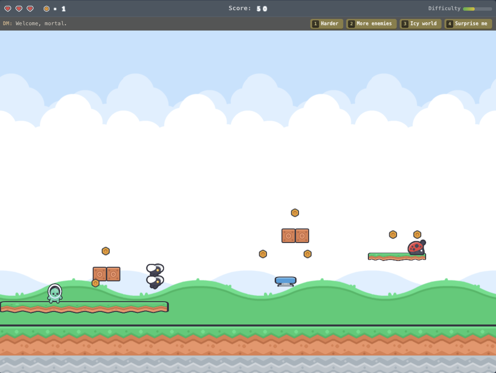

# AI Platformer

An infinite side-scrolling platformer where the AI is the game engine. Built with [CopilotKit](https://copilotkit.ai) and [LangGraph](https://langchain-ai.github.io/langgraph/).

<p align="center">
  
</p>

The AI acts as a **Dungeon Master** — designing levels in real-time, adapting difficulty based on your performance, and reacting to your commands with snarky commentary. No chat interface. The AI drives the game through CopilotKit's headless capabilities and state syncing.

## How It Works

- **You play** — run, jump, stomp enemies, collect coins, hit mystery blocks
- **The AI builds** — generates level chunks ahead of you as you run, with platforms, enemies, and collectibles
- **You command** — press 1-4 to tell the AI "Harder", "More enemies", "Icy world", etc.
- **The AI reacts** — adjusts difficulty, changes platform styles, taunts you via the DM bar

The game showcases CopilotKit's **headless mode** — no prebuilt chat UI, just hooks powering raw state, messages, and tool calls. The AI owns the game state; the frontend renders it.

## Tech Stack

| Layer | Technology |
|-------|-----------|
| Frontend | Next.js 16, React 19, Canvas 2D, TailwindCSS 4 |
| Agent | LangGraph (Python), OpenAI |
| Integration | CopilotKit v2 (headless agent state) |
| Assets | [Kenney New Platformer Pack](https://kenney.nl/assets/new-platformer-pack) (CC0) |
| Monorepo | Turborepo, pnpm workspaces |

## Architecture

```
Frontend (Next.js)                    Agent (LangGraph)
┌─────────────────┐                  ┌──────────────────┐
│  useAgent()     │◄── state sync ──►│  GameAgentState   │
│  Canvas 2D      │                  │  - level_chunks   │
│  Game Engine    │── messages ─────►│  - difficulty     │
│  HUD / Controls │                  │  - enemies/chunk  │
└─────────────────┘                  │  - dm_message     │
                                     │  - suggestions    │
                                     └──────────────────┘
                                            │
                                     ┌──────┴───────┐
                                     │ populate.py  │
                                     │ (enemies,    │
                                     │  coins,      │
                                     │  mystery     │
                                     │  blocks)     │
                                     └──────────────┘
```

The AI generates **platform layouts** — the creative part. A deterministic `populate.py` module adds enemies, coins, and mystery blocks based on the AI's difficulty and enemies_per_chunk settings. This hybrid approach gives the AI creative control while ensuring reliable gameplay.

## Features

- **AI-generated levels** — every run is unique
- **Dynamic difficulty** — AI reads its own state and adjusts based on your commands
- **6 platform types** — normal, moving, crumbling (collapses!), bouncy (launches you!), icy (slippery!), mystery (hit from below for coins)
- **3 enemy types** — walkers (ladybugs), flyers (bees), shooters (frogs)
- **DM personality** — snarky Dungeon Master reacts to everything you do
- **Instant start** — hardcoded starter chunks let you play immediately while the AI generates more
- **Kenney sprites** — professional pixel art, not programmer shapes
- **In-canvas HUD** — hearts, coins, score, difficulty bar, DM messages, keyboard-shortcut command buttons

## Getting Started

```bash
# Install dependencies
pnpm install

# Set your OpenAI API key
echo 'OPENAI_API_KEY=your-key-here' > .env

# Start everything (frontend + agent)
pnpm dev
```

Then open [http://localhost:3000](http://localhost:3000) and click **START GAME**.

### Controls

| Key | Action |
|-----|--------|
| Arrow keys / WASD | Move & Jump |
| Space | Jump |
| 1-4 | Activate command buttons |
| Enter | Start / Restart game |

## CopilotKit Features Showcased

- **Headless agent state** — `useAgent()` with no chat UI
- **Bidirectional state sync** — agent state drives the game world
- **Agent-driven content generation** — LLM designs game levels via tools
- **Dynamic suggestions** — AI-controlled command buttons update based on context
- **Real-time AI interaction** — player commands change the game world live

## License

Game code: MIT. Art assets: [Kenney CC0](https://kenney.nl/assets/new-platformer-pack).
